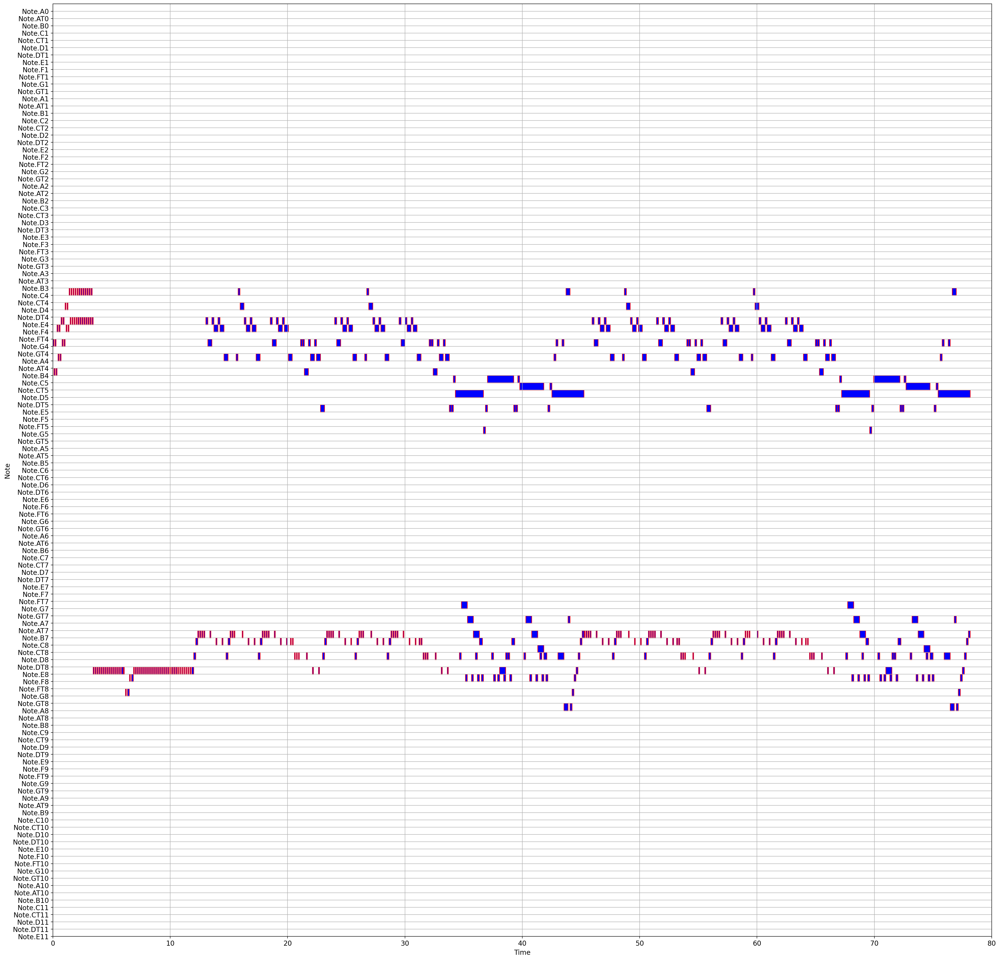
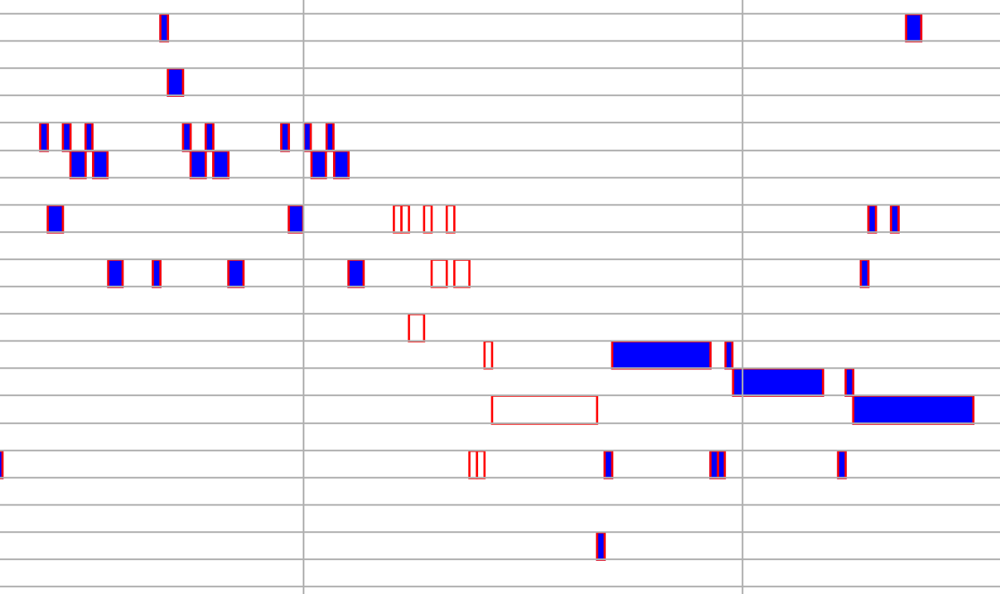
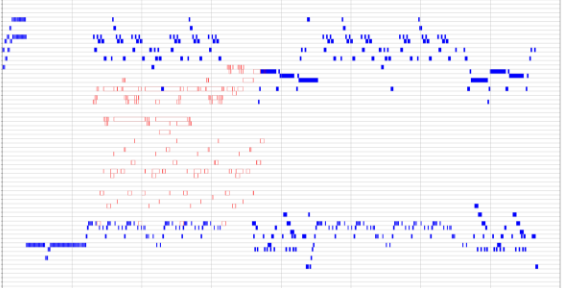

Hi, this is MinseoPark's folder.

# 저작권 등록

|저작권 등록| |
|---|---|
|프로그램 명칭|Music Annotation Tool(음원 평가 도구)|
|본 프로그램의 특|본 프로그램은 전문적인 음악 지식을 갖고 있는 사람이 음원을 듣고 점수를 평가하는 도구로 음원 평가 데이터베이스를 구축하기 위한 프로그램 입니다. 본 플랫폼은 플러터를 기반으로 만들어 졌으며, 데이터베이스 구축을 위해 서버 프로그램(파이썬 기반)과 연동이 되어 있습니다.|
|주요 기능|처음 웹사이트를 접속하게 되면 사용자의 정보를 입력하는 화면이 나옵니다. 해당 화면에서 사용자가 정보를 입력하면, 회원인 경우는 회원가입 화면을 보게 되고, 기존 회원은 바로 홈페이지에서 평가할 수 있도록 화면이 나옵니다.사용자는 평가 페이지에서 음원 동영상을 듣고, 이 때 음원은 Phrase를 기준으로 나뉘어 있으며, 오른쪽 버튼을 누르게 되면 다음 Phrase로 넘어가게 됩니다. 웹페이지에서는 Phrase를 Part로 표기 했습니다. 오른쪽 채점지에 점수를 입력합니다. 입력 후 저장 버튼을 클릭 해 서버에 데이터를 저장하게 됩니다.음원을 변경하기 위해서는 오른쪽 상단 음원버튼을 누르면, 사용자가 평가한 내용을 확인할 수 있는 평가 확인 페이지로 가는 버튼과 음원 리스트를 볼 수 있습니다. 해당 화면을 통해서 사용자는 본인이 평가한 내용과, 다른 음원을 평가 할 수 있습니다.|
|사용 방법|1. 소스파일 압축 해제2. server 폴더는 pycharm으로 열과, application폴더는 android studio(Flutter)로 열기3. 아나콘다 가상환경 생성 후, server 파일 속 requirements.txt (의존성) 설치4. mysql 설치5. 데이터베이스 서버 파일 실행 database.py -> 그 이후 호스트, 사용자, (데이터베이스)비밀번호 입력 두번하기6. 안드로이드 스튜디오로(flutter환경)에서 chrome을 기반으로 실행(이 때 크롬 오류 발생 시, 폴더 속 해결방법 참조)|

# 미디 시각화 정보
- 테스트에 사용한 데이터 (hello2.csv, hello3.csv)

| 클래스 이름            | 용도              | 함수 목록                                                              | 그림 예시                                   |
|-------------------|-----------------|--------------------------------------------------------------------|-----------------------------------------|
| MidiVisualization | 미디 -> 엑셀 -> 시각화 | showMidiGraph() showMidiInputGraph() showMidiTargetGraph() |  |
|||

# 미디 알고리즘 시각화 - 초마다, 노트들을 합쳐서 해당 초에 쳐야하는 노트들을 잘 쳤는지 확인해주기.

# 데이터 추출 과정

| 순서 | 작업 내용                                                                  |
|----|------------------------------------------------------------------------|
| 1  | Cubase 프로그램을 통해 맥북 연주 녹음 후 Midi Export                                 |
| 2  | ShinHyeong Park/[Mido] MIDI Data Combination V4.ipynb 파일을 통해 csv 파일 추출 |
| 3  | DataFrame을 통해 확인                                                       |

# test.py
- 시간에 따라 그래프에 미디 찍기

